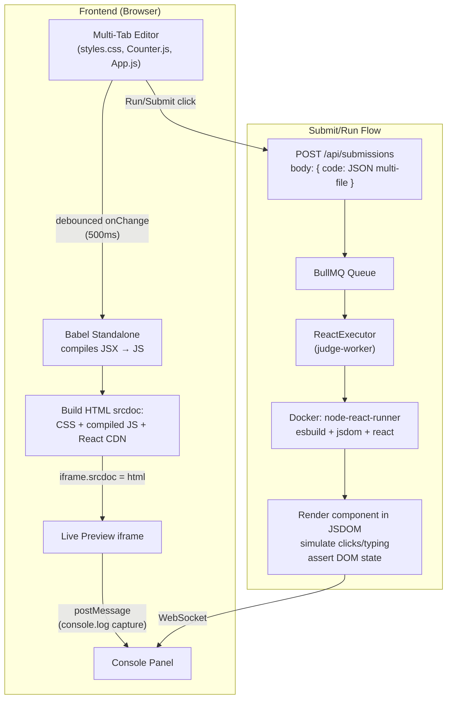

# React Workspace — NamasteDevs-Style Layout

Build a 3-panel React workspace with multi-file editor, live browser preview, and console — matching the NamasteDevs interview practice layout.

---

## Current vs Target Layout

### Current Layout (JS/SQL/MongoDB problems)

```
┌─────────────────────┬────────────────────────┐
│                     │    Monaco Editor        │
│  Problem            │    (single file)        │
│  Description        ├────────────────────────┤
│                     │    Console / Results    │
└─────────────────────┴────────────────────────┘
```

### Target Layout (React problems only)

```
┌──────────────┬──────────────────┬─────────────────┐
│              │ styles.css       │                  │
│  Problem     │ Counter.js       │  Browser Preview │
│  Description │ App.js           │  (live iframe)   │
│              │ (multi-tab       │                  │
│              │  Monaco editor)  ├─────────────────┤
│              │                  │  Console         │
├──────────────┴──────────────────┴─────────────────┤
│  ⏱ Timer    Attempts: 0          ▶ Run   ✈ Submit │
└───────────────────────────────────────────────────┘
```

The existing 2-panel layout stays unchanged for JS/SQL/MongoDB problems. The 3-panel layout only activates when `problem.category === 'REACT'`.

---

## Architecture: How It All Connects



---

## Proposed Changes

### 1. Database — Multi-File Starter Code

#### [MODIFY] [schema.prisma](file:///d:/interview-prep-platform/apps/backend-api/src/infrastructure/database/prisma/schema.prisma)

Add an optional `starterFiles` JSON field to the Problem model. This stores multi-file starter code for React problems while keeping `starterCode` backward compatible for all other categories.

```diff
 model Problem {
   id           String     @id @default(cuid())
   title        String
   slug         String     @unique
   description  String     @db.Text
   difficulty   Difficulty
   category     Category
   starterCode  String     @db.Text
+  starterFiles Json?      // Multi-file starter code for React: {"styles.css": "...", "App.js": "...", "Counter.js": "..."}
   solutionCode String?    @db.Text
```

> [!NOTE]
> `starterCode` still stores the main component code (the primary file the user edits). `starterFiles` stores ALL files as a JSON object. For React problems, the frontend reads `starterFiles`; for all other categories, it uses `starterCode` as before.

---

### 2. Backend API — Pass Multi-File Code

#### [MODIFY] [IQueueService.ts](file:///d:/interview-prep-platform/apps/backend-api/src/domain/ports/services/IQueueService.ts)

Update `SubmissionJob` to support multi-file code:

```diff
 export interface SubmissionJob {
   submissionId: string;
   userId: string;
   problemId: string;
   code: string;
+  files?: Record<string, string>;  // Optional multi-file map for React problems
   language: string;
 }
```

#### [MODIFY] [RunCode.ts](file:///d:/interview-prep-platform/apps/backend-api/src/application/use-cases/submission/RunCode.ts) & [SubmitSolution.ts](file:///d:/interview-prep-platform/apps/backend-api/src/application/use-cases/submission/SubmitSolution.ts)

Pass `files` through to the queue when the problem category is `REACT`.

#### [MODIFY] Problem API response

Include `starterFiles` in the problem detail response so the frontend can load multi-file tabs.

---

### 3. Judge Worker — ReactExecutor

#### [NEW] [Dockerfile.react-runner](file:///d:/interview-prep-platform/infrastructure/docker/Dockerfile.react-runner)

```dockerfile
FROM node:22-slim
WORKDIR /app
RUN npm init -y && npm install react@19 react-dom@19 esbuild jsdom
USER node
```

#### [NEW] [ReactExecutor.ts](file:///d:/interview-prep-platform/apps/judge-worker/src/executor/ReactExecutor.ts)

Implements `IExecutor`. Key differences from `JavascriptExecutor`:

- Uses `node-react-runner` Docker image
- Copies ALL files (styles.css, Component.js, App.js) into the container
- Runner script (`react-runner.js`) does:
  1. **Compile JSX**: Uses esbuild to transform JSX → JS
  2. **Setup JSDOM**: Creates a virtual DOM environment with `window`, `document`
  3. **Render**: Uses `ReactDOM.createRoot()` to render the component
  4. **Interact**: Simulates user actions (click, type) from test case `steps`
  5. **Assert**: Checks DOM state against test case `assertions`

**Test case format:**

```json
{
  "input": "{\"steps\":[{\"action\":\"click\",\"testId\":\"increment-btn\"},{\"action\":\"click\",\"testId\":\"increment-btn\"}],\"assertions\":[{\"testId\":\"count-display\",\"text\":\"2\"}]}",
  "expectedOutput": "\"passed\""
}
```

#### [MODIFY] [SubmissionWorker.ts](file:///d:/interview-prep-platform/apps/judge-worker/src/worker/SubmissionWorker.ts)

```diff
+import { ReactExecutor } from '../executor/ReactExecutor';
+const reactExecutor = new ReactExecutor();

 function getExecutorForCategory(category: string): IExecutor {
   switch (category) {
     case 'JAVASCRIPT':
     case 'NODEJS':
-    case 'REACT':
       return jsExecutor;
+    case 'REACT':
+      return reactExecutor;
```

The worker also needs to pass `files` from the job data to the ReactExecutor.

---

### 4. Frontend — 3-Panel React Workspace

This is the biggest change. Create a separate workspace component for React problems.

#### [NEW] `apps/frontend/src/components/workspace/ReactWorkspace.tsx`

The main 3-panel layout component. Rendered by [page.tsx](<file:///d:/interview-prep-platform/apps/frontend/src/app/(authenticated)/problems/[slug]/page.tsx>) when `problem.category === 'REACT'`.

**State management:**

```typescript
// Multi-file state
const [files, setFiles] = useState<Record<string, string>>({
  'styles.css': '', // CSS file
  'Counter.js': '', // Main component (name varies by problem)
  'App.js': '', // App wrapper that imports component
});
const [activeFile, setActiveFile] = useState<string>('Counter.js');

// Preview state
const [previewHtml, setPreviewHtml] = useState<string>('');
const [consoleLogs, setConsoleLogs] = useState<ConsoleEntry[]>([]);
```

**Layout structure:**

```
┌──────────────┬──────────────────┬─────────────────┐
│  DescPanel   │  EditorPanel     │  PreviewPanel   │
│  (25% width) │  (40% width)     │  (35% width)    │
│              │                  │                 │
│  - Problem   │  - Tab bar       │  - iframe       │
│  - Solution  │    (file tabs)   │    (srcdoc)     │
│  - Notes     │  - Monaco Editor │                 │
│              │                  ├─────────────────┤
│              │                  │  ConsolePanel   │
│              │                  │  (30% height)   │
└──────────────┴──────────────────┴─────────────────┘
│              Bottom Bar: Timer, Run, Submit        │
└───────────────────────────────────────────────────┘
```

#### [NEW] `apps/frontend/src/components/workspace/LivePreview.tsx`

The live browser preview component using an `<iframe>`.

**How the live preview works:**

1. User edits a file in the multi-tab editor
2. After 500ms debounce, `buildPreview()` runs:

   ```typescript
   function buildPreview(files: Record<string, string>): string {
     return `
       <!DOCTYPE html>
       <html>
       <head>
         <style>${files['styles.css']}</style>
         <script src="https://unpkg.com/react@19/umd/react.development.js"></script>
         <script src="https://unpkg.com/react-dom@19/umd/react-dom.development.js"></script>
         <script src="https://unpkg.com/@babel/standalone/babel.min.js"></script>
       </head>
       <body>
         <div id="root"></div>
         <script>
           // Capture console.log and send to parent
           const origLog = console.log;
           console.log = (...args) => {
             origLog(...args);
             window.parent.postMessage({ type: 'console', level: 'log', args: args.map(String) }, '*');
           };
           // Same for console.error, console.warn
         </script>
         <script type="text/babel" data-type="module">
           ${files['Counter.js']}
           ${files['App.js']}
   
           const root = ReactDOM.createRoot(document.getElementById('root'));
           root.render(React.createElement(App));
         </script>
       </body>
       </html>
     `;
   }
   ```

3. Set `iframe.srcdoc = html`
4. iframe renders the React component live

> [!IMPORTANT]
> **Babel Standalone** is loaded from CDN inside the iframe. It compiles JSX in-browser for the live preview. This is separate from the judge-worker which uses esbuild for server-side compilation.

#### [NEW] `apps/frontend/src/components/workspace/ConsolePanel.tsx`

Captures `postMessage` events from the iframe to show `console.log/error/warn` output.

```typescript
useEffect(() => {
  const handler = (event: MessageEvent) => {
    if (event.data?.type === 'console') {
      setConsoleLogs((prev) => [
        ...prev,
        {
          level: event.data.level,
          message: event.data.args.join(' '),
          timestamp: Date.now(),
        },
      ]);
    }
  };
  window.addEventListener('message', handler);
  return () => window.removeEventListener('message', handler);
}, []);
```

#### [MODIFY] [page.tsx](<file:///d:/interview-prep-platform/apps/frontend/src/app/(authenticated)/problems/[slug]/page.tsx>)

Conditionally render the workspace based on category:

```tsx
if (problem.category === 'REACT') {
  return <ReactWorkspace problem={problem} />;
}

// Existing 2-panel layout for JS/SQL/MongoDB...
return <div className="flex flex-col h-[calc(100vh-5.5rem)]">{/* ... existing code ... */}</div>;
```

---

### 5. Seed Data — 5 React Problems

#### [MODIFY] [seed.ts](file:///d:/interview-prep-platform/apps/backend-api/src/infrastructure/database/prisma/seed.ts)

Each React problem has both `starterCode` (main component) and `starterFiles` (all files):

**Example — Counter App (order: 24):**

```typescript
{
  title: 'Counter App',
  slug: 'counter-app',
  description: `Build a Counter component with increment and decrement buttons...`,
  difficulty: 'EASY',
  category: 'REACT',
  starterCode: `function Counter() {
  // Use useState to track the count
  // Render:
  //   - A display showing the current count (data-testid="count-display")
  //   - An increment button (data-testid="increment-btn")
  //   - A decrement button (data-testid="decrement-btn")
}`,
  starterFiles: {
    'styles.css': `.counter { text-align: center; padding: 20px; }
.counter h2 { font-size: 48px; margin: 20px 0; }
.counter button { padding: 10px 20px; margin: 0 10px; font-size: 18px; cursor: pointer; }`,
    'Counter.js': `function Counter() {
  // Use React.useState to track the count
  // Render a display and two buttons
}`,
    'App.js': `function App() {
  return (
    <div className="counter">
      <h1>Counter App</h1>
      <Counter />
    </div>
  );
}`
  },
  solutionCode: `function Counter() {
  const [count, setCount] = React.useState(0);
  return (
    <div>
      <h2 data-testid="count-display">{count}</h2>
      <button data-testid="decrement-btn" onClick={() => setCount(count - 1)}>-</button>
      <button data-testid="increment-btn" onClick={() => setCount(count + 1)}>+</button>
    </div>
  );
}`,
  tags: ['react', 'state', 'events'],
  isPublished: true,
  order: 24,
  testCases: {
    create: [
      {
        input: '{"steps":[{"action":"click","testId":"increment-btn"},{"action":"click","testId":"increment-btn"},{"action":"click","testId":"increment-btn"}],"assertions":[{"testId":"count-display","text":"3"}]}',
        expectedOutput: '"passed"',
        isHidden: false,
        order: 1,
      },
      {
        input: '{"steps":[{"action":"click","testId":"decrement-btn"},{"action":"click","testId":"decrement-btn"}],"assertions":[{"testId":"count-display","text":"-2"}]}',
        expectedOutput: '"passed"',
        isHidden: false,
        order: 2,
      },
      {
        input: '{"steps":[{"action":"click","testId":"increment-btn"},{"action":"click","testId":"increment-btn"},{"action":"click","testId":"decrement-btn"}],"assertions":[{"testId":"count-display","text":"1"}]}',
        expectedOutput: '"passed"',
        isHidden: true,
        order: 3,
      },
    ],
  },
}
```

**All 5 problems:**

| #   | Title              | Slug                 | Difficulty | Key `data-testid`s                                           | Test Scenarios                                      |
| --- | ------------------ | -------------------- | ---------- | ------------------------------------------------------------ | --------------------------------------------------- |
| 24  | Counter App        | `counter-app`        | EASY       | `count-display`, `increment-btn`, `decrement-btn`            | Click combos, verify count                          |
| 25  | Toggle Button      | `toggle-button`      | EASY       | `toggle-btn`, `status-text`                                  | Toggle ON/OFF state                                 |
| 26  | Show/Hide Password | `show-hide-password` | EASY       | `password-input`, `toggle-visibility`                        | Check input type switches between `password`/`text` |
| 27  | Todo App           | `todo-app`           | MEDIUM     | `todo-input`, `add-btn`, `todo-item`, `toggle-0`, `delete-0` | Add, toggle, delete items                           |
| 28  | Fetch API Data     | `fetch-api-data`     | MEDIUM     | `loading`, `user-list`, `user-item`, `error-message`         | Mock fetch success/failure                          |

---

## Open Questions

> [!IMPORTANT]
> **React CDN vs bundled:** The live preview loads React from CDN (`unpkg.com`). This means:
>
> - ✅ No build step needed for preview
> - ❌ Won't work offline
> - ❌ User can't use `import` syntax — must use `React.useState` instead of `import { useState } from 'react'`
>
> Should we accept `React.useState(...)` syntax, or bundle React into the preview HTML?

> [!IMPORTANT]
> **Resizable panels:** Should we use `react-resizable-panels` for drag-to-resize between the 3 columns? Or use fixed widths (25% / 40% / 35%)?

---

## Verification Plan

### Build Steps

```bash
# 1. Migrate DB for starterFiles field
npx prisma migrate dev --name add_starter_files --schema apps/backend-api/src/infrastructure/database/prisma/schema.prisma

# 2. Build Docker image
docker build -t node-react-runner -f infrastructure/docker/Dockerfile.react-runner .

# 3. Re-seed
npx prisma db seed --schema apps/backend-api/src/infrastructure/database/prisma/schema.prisma

# 4. Start dev
npm run dev
```

### Manual Verification

- Open a React problem → verify 3-panel layout renders
- Edit Counter.js → verify live preview updates
- Edit styles.css → verify CSS applies in preview
- Click Run → verify test results show in console
- Click Submit → verify submission is accepted
- Open a JS problem → verify 2-panel layout still works
